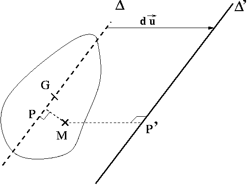
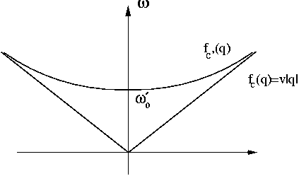
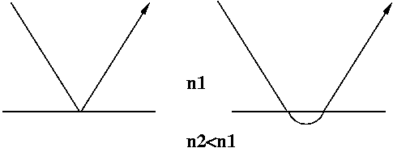
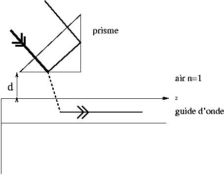

# Chaı̂ne avec balourd

## Equations générales

### moment d’inertie

On applique le théorème de Huygens (qu'on va redémontrer).

!!! th "Théorème de Huygens"

    \begin{align*}
    J' = J + Ml^2
    \end{align*}

Démonstration (rappel):

Soit (S) un solide et $\Delta'$ une droite. On cherche le moment d'inertie de (S) par rapport à $\Delta'$.  On introduit la droite $\Delta$, passant par G (centre d'inertie de (S) ) et parallèle à $\Delta'$. $\Delta'$ est la translatée de $\Delta$ par le vecteur unitaire $\vec{u}$ sur une distance $l$.

On appelle $M$ le point courant décrivant le volume de (S) et P' (resp. P) le projeté orthogonal sur $\Delta'$ (resp. $\Delta$).

Par définition du moment d'inertie :

\begin{align*}
J' = \iiint_{S} (MP')^{2} \, dm
\end{align*}

On décompose $(MP')^2$ en introduisant P :

\begin{align*}
(MP')^{2} = (\overrightarrow{MP} + \overrightarrow{PP'} )^{2} = MP^{2} + 2\overrightarrow{MP} . \overrightarrow{PP'} + l^2
\end{align*}

On renvoit ceci dans la définition de $J'$ :

\begin{align*}
J' = \iiint_{S} MP^{2}  dm  + 2 \Big( \iiint_{S} dm  \overrightarrow{MP} \Big) . d\vec{u} + \Big(  \iiint_{S} dm \Big) l^2
\end{align*}

Le premier terme donne $J$, le troisième $Ml^2$ et le second terme est nul car :

\begin{align*}
\vec{u} . \iiint_{S} dm \overrightarrow{MP} = \vec{u} . \iiint_{S} dm ( \overrightarrow{MG} + \overrightarrow{GP} ) = \vec{u} . \iiint_{S} dm  \overrightarrow{MG} +  \vec{u} . \iiint_{S} dm  \overrightarrow{GP}
\end{align*}

La première intégrale est nulle d'après la propritété remarquable d'un centre de masse; et la seconde intégrale est nulle car $\vec u$ et $\overrightarrow{GP}$ sont orthogonaux. CQFD.

<figure markdown>
  
  <figcaption></figcaption>
</figure>

### nouvelle équation du mouvement

Il faut à présent tenir compte du couple exercé en $O_n$ par le poids appliqué en $G_n$; soit en projection sur l'axe de la chaîne :

\begin{align*}
( \overrightarrow{O_nG_n} \wedge M\overrightarrow{g} ). \vec{u_x} = - Mgl \sin \theta_n
\end{align*}

!!! eq "nouvelle équation du mouvement"

    \begin{align*}
    J'\ddot{\theta_n} + C(2\theta_n - \theta_{n-1}  - \theta_{n+1}) + Mgl\sin \theta_n = 0
    \end{align*}

### nouvelle expression de l’énergie mécanique

Il faut tenir compte d'une énergie potentielle de pesanteur $E_{pp}$ (puisque maintenant le travail du poids n'est plus nul); on choisit l'origine pour $\theta_n = 0$ :

\begin{align*}
E_{pp}(n) = - W(poids) = - Mg \Delta(z) = -Mgl(\cos \theta_n - 1)
\end{align*}

Soit :

\begin{align*}
E = \sum_{n \in \mathcal{Z}} E_c(n) + Ep_{torsion}(n) + Ep_{pesanteur}(n) = \sum_{n \in \mathcal{Z}} \Big[ \frac{J' \dot\theta_n}{2} + C\theta_n(\theta_n - \theta_{n+1}) + Mgl(1-\cos \theta_n) \Big]
\end{align*}

### existence de solutions exactes

Il n'existe pas de solutions en onde plane car le dernier terme de l'équation n'est pas linéaire en $\theta$ ($e^{i\omega t}$ et $\sin (e^{i\omega t})$ sont des fonctions linéairement indépendantes !).

## Approximation des petits angles

### recherche de la nouvelle relation de dispersion

- On développe l'énergie potentielle de pesanteur autour de la position d'équilibre : $E_{pp}(n) = Mgl\frac{\theta_n^2}{2}$; on peut alors linéariser l'équation du mouvement :

\begin{align*}
J'\ddot{\theta_n} + C(2\theta_n - \theta_{n-1}  - \theta_{n+1}) + Mgl \theta_n = 0
\end{align*}

Des solutions progressives peuvent exister à condition que :

\begin{align*}
-J'\omega^2 + 4C\sin^2 \frac{qa}{2} + Mgl = 0
\end{align*}

- on réécrit cette relation sous la forme :

\begin{align*}
\omega(q) = \omega_{0}' \sqrt{1 + \frac{4C}{J'} \frac{\sin^{2} \frac{qa}{2}}{\omega_{0}^{'2}} }
\end{align*}

### bande de fréquences permises

- pulsation de coupure basse : $\omega_{0}'$

- pulsation de coupure haute : $\omega_{c}' = \omega_{0}' \sqrt{1 + \frac{4C}{J'\omega_{0}^{'2} } }$

- en se placant en bord de zon de Brillouin ($\theta_{n+1} = -\theta_n$), on obtient l'équation :

\begin{align*}
J' \ddot\theta_n + (4C+J'\omega_{0}^{'2})\theta_n = 0
\end{align*}

c'est un mouvement harmonique à la pulsation de coupure haute : $\omega_{c}'$

En se placant au centre de la zone de Brillouin ($\theta_{n+1} = \theta_n$), on obtient cete fois :

\begin{align*}
J' \ddot\theta_n + Mgl\theta_n = 0
\end{align*}

mouvement harmonique à la pulsation de coupure basse.

## Approximation de la chaı̂ne continue

### équation du mouvement

!!! eq "relation entre $J'$, $M$ et $\mu$"

    \begin{align*}
    J' & =  &\mathcal{J'} a \\
    M  & =  & \mu a
    \end{align*}

- on fait tendre $a$ vers zéro dans l'équation de $\theta_n$ :

\begin{align*}
\frac{\partial^2 \theta}{\partial t^2} - \frac{\mathcal{C}}{\mathcal{J'}} \frac{\partial^2 \theta}{\partial x^2} + \frac{\mu gl}{\mathcal{J'}} \sin \theta = 0
\end{align*}

### Approximation des petits angles

- on réécrit l'équation en approximant $\sin \theta(x,t)$ par $\theta(x,t)$ :

\begin{align*}
\frac{\partial^2 \theta}{\partial t^2} - \frac{\mathcal{C}}{\mathcal{J'}} \frac{\partial^2 \theta}{\partial x^2} + \frac{\mu gl}{\mathcal{J'}} \theta = 0
\end{align*}

On peut alors écrire la condition d'existence de solutions progressives $e^{i(qx-\omega t)}$ :

\begin{align*}
-\omega^2 + \frac{C}{\mathcal{J'}}q^2 + \frac{\mu gl}{\mathcal{J'}}
\end{align*}

- la relation de dispersion :

\begin{align*}
\omega = f_{c'}(q) = \sqrt{\frac{\mathcal{C}}{\mathcal{J'}} q^2 + \frac{\mu gl}{\mathcal{J'}}} = \sqrt{ {v'}^2 q^2 + {\omega_{0}'}^2}
\end{align*}

- le graphe :

<figure markdown>
  
  <figcaption>Relation de dispersion de la chaîne avec balourd, modèle continu.</figcaption>
</figure>

Il s'agit d'une branche hyperbole ayant pour asymptote la courbe $\omega = v|q| = f_c(q)$.

- la coupure basse correspond au milieu de la zone de Brillouin ($\theta_{n+1} = \theta_n$, tout se passe comme si la torsion n'intervenait pas). Ici, en continu, on peut déterminer la pulsation de coupure basse en négligeant dans l'équation continue les dérivées partielles spatiales de $\theta$ :

\begin{align*}
\frac{\partial^2 \theta}{\partial t^2} + \frac{\mu gl}{\mathcal{J'}} \theta = 0
\end{align*}

C'est la même coupure basse basse qu'en discret puisque la torsion n'intervient pas.

### réflexion-réfraction ?

- [$\omega_{0} < \omega_{0}'$ :] $\omega_{0}^2 - {\omega_{0}'}^2 = \frac{\mathcal{C}}{\mathcal{J'}}q^2 < 0$ donc $q$ est **imaginaire pur** : $q = i |q|$.

Dans le milieu 1, on a une simple réflexion.

Dans le milieu 2, on obtient une solution de type **onde évanescente** :

\begin{align*}
t_{12}Ae^{-|q|x}e^{-i\omega_{0}t}
\end{align*}

- [$\omega_{0} > \omega_{0}'$ :]  $\omega_{0}^2 - {\omega_{0}'}^2 = \frac{\mathcal{C}}{\mathcal{J'}}q^2 > 0$ donc q est **réel**.

Il y a transmission d'une onde progressive dans le milieu 2;

### cas $\omega_ 0 < \omega_0'$

- solution générale (en complexe) :

\begin{align*}
\text{si}\,\,\, & x \leq0 & : \theta(x,t) = & A_i e^{-i(\omega_0 t - \frac{x}{v} )} +  A_r e^{-i(\omega_0 t + \frac{x}{v} )}  \\
\text{si}\,\,\, & x \geq0 & : \theta(x,t) = & A_t e^{-K_0 x} e^{-i\omega_0 t}
\end{align*}

On a éliminé d'office la solution divergente en $x \rightarrow +\infty$ dans le milieu 2.

- conditions aux limites :

On suppose $A_i$ réel et on pose :

\begin{align*}
A_r = |A_r| e^{i\phi_r}\\
A_t = |A_t| e^{i\phi_t}
\end{align*}

- on va utiliser les conditions aux limites suivantes:

    - [$\theta$ est continu en x=0 :] $A_i + A_r = A_t$.
Cela donne deux équations (une pour la partie réelle et une pour la partie imaginaire)
    - [la puissance transmise $\mathcal{G}$ est continue en x=0 :] (on utilise les quantités réelles).

Ce qui donne :

\begin{align*}
\Big( -\mathcal{C} \frac{\partial \theta}{\partial t} \frac{\partial \theta}{\partial x}\Big)_{x=0^{-}} & = & \Big(-\mathcal{C} \frac{\partial \theta}{\partial t} \frac{\partial \theta}{\partial x}\Big)_{x=0^{+}} \\
\end{align*}

et

\begin{align*}
\mathcal{J}v |A_i|^2 \omega_{0}^2 \sin ^2 (\omega_0 t) - \mathcal{J}v |A_r|^2 \omega_{0}^2 \sin ^2 (\omega_0 t - \phi_r) & = & -\mathcal{C}|A_t|^2 K_0 \omega_0 \sin (\omega_0 t - \phi_t) \cos (\omega_0 t - \phi_t) 
\end{align*}

Après simplifications et identification des coefficients sur la base $\{ \sin 2\omega_0 t ; \cos 2\omega_0 t \}$, on obtient deux nouvelles équations.

Finalement, il reste un système à quatre inconnues ($|A_r|, |A_t|, \phi_r, \phi_t$) que l'on résout :

\begin{align*}
|A_r| & = & |A_i| \\
|A_t| & = & \frac{2}{ \sqrt{1+ \big( \frac{K_0 v}{\omega_0} \Big)^2 } }|A_i| \\
\phi_r & = & -2 \phi \\
\phi_t & = & - \phi
\end{align*}

où la phase $\phi$ est définie par :

\begin{align*}
\cos \phi = \frac{1}{ \sqrt{1+ \big( \frac{K_0 v}{\omega_0} \Big)^2 }}\\
\sin \phi = \frac{ \frac{K_0 v}{\omega_0} }{ \sqrt{1+ \big( \frac{K_0 v}{\omega_0} \Big)^2 }}
\end{align*}

En notation complexe :

\begin{align*}
A_r & = & A_i e^{-i2\phi} \\
A_t & = & \frac{2}{ \sqrt{1+ \big( \frac{K_0 v}{\omega_0} \Big)^2 }} A_i e^{-i\phi}
\end{align*}

- on peut vérifier que $\mathcal{G}$ conserve la même expression que pour la chaîne sans balourd. La nouvelle expresion de $\mathcal{E}$, tenant compte de l'énergie potentielle de pesanteur est :

\begin{align*}
\text{si}\,\,\, & x \leq0 & : \mathcal{E} (x,t) &= \frac{\mathcal{J}}{2} \big( \frac{\partial \theta}{\partial t} \big)^2 + \frac{\mathcal{C}}{2} \big( \frac{\partial \theta}{\partial x} \big)^2 \\
\text{si}\,\,\, & x >0 & : \mathcal{E} (x,t) &= \frac{\mathcal{J'}}{2} \big( \frac{\partial \theta}{\partial t} \big)^2 + \frac{\mathcal{C}}{2} \big( \frac{\partial \theta}{\partial x} \big)^2 + \mu gl \frac{\theta^2}{2}
\end{align*}

Après simplifications, il reste : $\frac{\partial \mathcal{E}}{\partial t} = - \frac{\partial}{\partial x} \big( -\mathcal{C}\frac{\partial \theta}{\partial t}\frac{\partial \theta}{\partial t} \big)$ dans les deux milieux et donc $\mathcal{G}$ conserve la même expression. Cela était évident puisque la pesanteur n'intervient pas dans le couplage des disques et donc dans le transfert d'énergie.

Dans les deux régions, il n'y a pas de transfert moyen d'énergie :  $<\mathcal{G}(x,t)> = 0$.

- l'onde réfléchie a la même amplitude que l'onde incidente; elle transporte la même énergie mais en sens inverse.

- l'onde transmise est évanescente : il n'y a pas de propagation d'énergie.

- En électromagnétisme : passage d'une OEM entre le vide et un bon conducteur (effet de peau). Dans un bon conducteur, il n'y pas d'onde progressive mais évanescente : l'énergie est dissipée par effet Joule dans le volume de conducteur.

### région 1

- l'onde incidente s'écrit :

\begin{align*}
\theta_i(x,t) = \mathbb{R}e \Big\{ \int_{\omega_o-\frac{\Delta \omega}{2}}^{\omega_o+\frac{\Delta \omega}{2}} d\omega \mathcal{B}_i(\omega)e^{iq(x-vt)} \Big\}
\end{align*}

le mouvement du centre du paquet d'onde est une translation uniforme : $x(t)=vt$.

- Chaque composante est réfléchie avec le coefficient complexe calculé précédemment (en remplacant $\omega_0$ par $\omega$) :

\begin{align*}
\theta_r(x,t) = \mathbb{R}e \Big\{ \int_{\omega_0-\frac{\Delta \omega}{2}}^{\omega_o+\frac{\Delta \omega}{2}} d\omega \mathcal{B}_i(\omega) R(\omega) e^{-iq(x+vt)} \Big\}
\end{align*}

où $R(\omega) = e^{-2i\phi}$ et $\phi(\omega)$ tel que :

\begin{align*}
\cos \phi(\omega) = \frac{1}{ \sqrt{1+ \big( \frac{K(\omega) v}{\omega} \Big)^2 }}\\
\sin \phi(\omega) = \frac{ \frac{K(\omega) v}{\omega} }{ \sqrt{1+ \big( \frac{K(\omega) v}{\omega} \Big)^2 }}
\end{align*}

- la phase de la composante $\omega$ du paquet d'onde réfléchi est $q(\omega)x+\omega t + 2\phi(\omega)$. On écrit que cette phase doit être stationnaire (ondes en phase; interférence constructive) autour de $\omega_0$ :

\begin{align*}
\frac{d}{d\omega}(q(\omega)x + \omega t + 2\phi(\omega)) = 0 \\
\end{align*}

soit

\begin{align*}
x_r(t) = -v \big[ t + 2\phi'(\omega_0) \big]
\end{align*}

On peut calculer assez facilement $\phi'(\omega_0)$ en dérivant $\tan \phi(\omega)$; on obtient :

\begin{align*}
\frac{d\phi}{d\omega} \Big|_{\omega_0} = -vv' \frac{ {\omega_0'}^2 \sqrt{ {\omega_0'}^2 - \omega_0^2 } }{ ({\omega_0'}^2 - \omega_0^2) \big[ ({\omega_0'}^2 - \omega_0^2)v^2 + \omega^2 {v'}^2 \big]  }
\end{align*}

Cette expression est homogène à l'inverse d'une pulsation donc à un temps, qui plus est négatif :

\begin{align*}
\frac{d\phi}{d\omega} \Big|_{\omega_0} = -\tau
\end{align*}

- Il s'agit d'un mouvement uniforme à la vitesse $v$ :

\begin{align*}
x_r(t) = -v (t - 2 \tau)
\end{align*}

$2\tau$ est un retard à la réflexion. Alors que le centre du paquet d'onde incident arrive sur le dioptre ($x=0$) à $t=0$, le paquet réfléchi émerge à $t=2\tau$.

### région 2

- Chaque composante du paquet incident donne une onde transmise avec le coefficient complexe : $\frac{2}{ \sqrt{1 + \frac{K(\omega)}{q(\omega)} } } e^{-i\phi(\omega)}$ d'où :

\begin{align*}
\theta_2(x,t) & = & \mathbb{R}e \Big\{ \int_{\omega_0-\frac{\Delta \omega}{2}}^{\omega_0+\frac{\Delta \omega}{2}} d\omega \mathcal{B}_i(\omega)\frac{2}{ \sqrt{1 + \frac{K(\omega)}{q(\omega)} } } e^{-i\phi(\omega)} e^{-iK(\omega)x} e^{-i\omega t} \Big\}\\
\theta_2(x,t) & = & \int_{\omega_o-\frac{\Delta \omega}{2}}^{\omega_o+\frac{\Delta \omega}{2}} d\omega \mathcal{B}_i(\omega)\frac{2}{ \sqrt{1 + \frac{K(\omega)}{q(\omega)} } } e^{-K(\omega)x} \cos (\omega t + \phi(\omega))
\end{align*}

- Ici on ne peut pas trouver d'abscisse correspondant à un centre du paquet d'onde car $x$ et $t$ ne sont plus couplées dans la phase!

L'amplitude est maximale lorsqu'il y a interférence constructive :  $\frac{d}{d\omega} (\omega t + \phi(\omega)) = 0$; soit $t= \tau$.

- On peut interpréter ce phénomène en disant que :

    - [$t>0$ :] le paquet incident se déplace vers le dioptre.
    - [$t=0$ :] le paquet incident arrive sur le dioptre.
    - [$0 \leq t \leq \tau$ :] le paquet incident pénètre dans la région 2.
    - [$t=\tau$ :] maximun d'amplitude de l'onde transmise; le paquet incident fait demi tour.
    - [$\tau \leq t \leq 2\tau$ :] naissance du paquet réfléchi
    - [$t=2\tau$ :] le paquet réfléchi émerge du dioptre.

!!! remark "remarque"

    Ce phénomène se rencontre dans d'autres domaines de la physique : l'optique non linéaire : on appelle cela l'[effet Goos-Hänchen](https://fr.wikipedia.org/wiki/Effet_Goos%E2%80%93H%C3%A4nchen).

<figure markdown>
  
  <figcaption>Effet Goss-Hänchen en optique.</figcaption>
</figure>

### question finale : évocation de l’effet tunnel

- solution générale en complexe :

\begin{align*}
\textrm{région} 1 & : & \theta_1(x,t) &= A_i e^{i(qx-\omega_0 t)} + A_r e^{-i(qx+\omega_0 t) }\\
\textrm{région} 2 & : & \theta_2(x,t) &= ( B_1 \cosh K_0x + B_2 \sinh K_0x ) e^{-i\omega_0 t}\\
\textrm{région} 3 & : & \theta_3(x,t) &= C_1 e^{i[q(x-d)-\omega_0 t]} +  C_2 e^{-i[q(x-d)+\omega_0 t]}
\end{align*}

- La question nécessite quelques calculs pour arriver à la réponse de l'énoncé!

Les conditions aux limites :

- on suppose qu'il n'y a pas de source en $x = +\infty$ donc $C_2 = 0$.
- $\theta$ est continu en $x=0$ et $x=d$ :

\begin{align*}
A_i + A_r & = & C_1 \\
B_1 \cosh K_0d + B_2 \sinh K_0d & = & C_1
\end{align*}

- la puissance transmise est continue en $x=0$ et $x=d$ :

\begin{align*}
\mathcal{J}v |A_i|^2 \omega_0^2 \sin^2 (\omega_0 t ) & = & - \mathcal{C} \frac{\partial \theta}{\partial t} \frac{\partial \theta}{\partial x} \Big|_{x=0^{+}}\\
 - \mathcal{C} \frac{\partial \theta}{\partial t} \frac{\partial \theta}{\partial x} \Big|_{x=d^{-}} & = & \mathcal{J}v |C_1|^2 \omega_0^2 \sin^2 (\omega_0 t - \phi_3)
\end{align*}

On détermine les expressions de $- \mathcal{C} \frac{\partial \theta}{\partial t} \frac{\partial \theta}{\partial x} \Big|_{x=0^{+}}$ et $-\mathcal{C} \frac{\partial \theta}{\partial t} \frac{\partial \theta}{\partial x} \Big|_{x=d^{-}}$ à partir des expressions de $\frac{\partial \theta}{\partial x}$ et $\frac{\partial \theta}{\partial t}$ dans la région 2.

Après quelques calculs en complexe on trouve les coefficients $B_1$ et $B_2$ en fonction de $C$; puis $C$ en fonction de $A_i$ :

\begin{align*}
B_1 = \sqrt{1+ \big(\frac{\omega_0}{K_0v}  \big)^2} \cosh (K_0d - i\phi' ) C \\
B_1 =-\sqrt{1+ \big(\frac{\omega_0}{K_0v}  \big)^2} \sinh (K_0d - i\phi' ) C
\end{align*}

où l'angle $\phi'$ est défini par :

\begin{align*}
\cos \phi' = \frac{1}{\sqrt{1+ \big(\frac{\omega_0}{K_0v} \big)^2 }} = \sin \phi\\
\sin \phi' = \frac{ \frac{\omega_0}{K_0v} }{ \sqrt{1+ \big(\frac{\omega_0}{K_0v} \big)^2 }} = \cos \phi
\end{align*}

On remarque que $\phi'=\frac{\pi}{2} - \phi$.

On pose $2\psi = \phi - \phi' - \frac{\pi}{2} = 2\phi - \pi$ ($\psi$ joue le rôle du $\phi$ de l'énoncé puisque $\phi$ conserve la signification qu'il a dans les questions précédentes). On a alors :

\begin{align*}
C = \frac{\sinh 2i\psi}{\sinh (K_0d+2i\psi)}A_i
\end{align*}

C'est la formule de l'énoncé.

!!! eq "la solution complète"

    \begin{align*}
    A_r& =& \frac{\sinh (K_0d)}{\sinh (K_0d+2i\psi) } \sinh^2 2i\psi A_i \\
    B_1& =& \frac{\cosh (K_0d+i\psi)}{\sinh (K_0d +2i\psi) } \frac{\sinh 2i\psi}{\cosh (i\psi)}  A_i \\
    B_2& =&-\frac{\sinh (K_0d+i\psi)}{\sinh (K_0d +2i\psi) } \frac{\sinh 2i\psi}{\cosh (i\psi)}  A_i \\
    C& =&  \frac{\sinh 2i\psi}{\sinh (K_0d+2i\psi)}A_i
    \end{align*}

- On considère à présent un paquet d'onde incident; et on suppose que $\forall \omega \in [\omega_0-\frac{\Delta \omega}{2} , \omega_0+\frac{\Delta \omega}{2}]$ on a $K(\omega)d>>1$.

On écrit le paquet d'onde dans la région 3 à l'aide du coefficient $C$ dépendant de $\omega$ :

\begin{align*}
\theta_3(x,t)  = \mathbb{R}e \Big\{ \int_{\omega_0-\frac{\Delta \omega}{2} }^{\omega_0+\frac{\Delta \omega}{2}}  d\omega \mathcal{B}_i(\omega) \frac{\sinh 2i\psi(\omega)}{\sinh[ K(\omega)d+2i\psi(\omega)] } e^{i [ q(\omega)(x-d) - \omega t ]} \Big\}
\end{align*}

On peut alors prendre un équivalent du sinus hyperbolique pour les grandes valeurs :

\begin{align*}
\sinh \sim \frac{e^x}{2}
\end{align*}

il reste :

\begin{align*}
\theta_3(x,t)  = \mathbb{R}e \Big\{ \int_{\omega_0-\frac{\Delta \omega}{2} }^{\omega_0+\frac{\Delta \omega}{2}}  d\omega \mathcal{B}_i(\omega) \sinh(2i\psi(\omega)) i e^{-i2\psi(\omega)}  e^{i [ q(\omega)(x-d) - \omega t ]} \Big\}
\end{align*}

- par la méthode de la phase stationnaire :

\begin{align*}
\frac{d}{d\omega}(q(\omega)(x-d) +)- \omega t + \frac{\pi}{2}- 2\psi(\omega)) = 0
\end{align*}

soit

\begin{align*}
x(t)= d +v(t + 2 \big( \frac{d\psi}{d\omega} \big)_{\omega_0} )
\end{align*}

Il émerge, en $x=d$, à $t= -2\big( \frac{d\psi}{d\omega} \big)_{\omega_0} >0$.

- Dans l'approximation faite ce temps est indépendant de $d$! C'est assez spectaculaire, quelque soit l'épaisseur à traverser (restant petite) le paquet d'onde met le même temps.

- C'est l'[effet tunnel](https://fr.wikipedia.org/wiki/Effet_tunnel) de la mécanique quantique!!

Lorsqu'une particule, représentée par une [fonction d'onde](https://fr.wikipedia.org/wiki/Fonction_d%27onde), arrive sur barrière de potentiel plus haute que son énergie totale, la théorie quantique prévoit que la particule a une probabilité non nulle de se retrouver de l'autre côté de la barrière alors que cela est impossible en mécanique classique!

applications :

- en optique :

<figure markdown>
  
  <figcaption>Comment introduire de la lumière dans un guide d'onde à l'aide d'un prisme.</figcaption>
</figure>

 la [réflexion totale frustrée](https://fr.wikipedia.org/wiki/R%C3%A9flexion_totale#Onde_%C3%A9vanescente,_r%C3%A9flexion_totale_frustr%C3%A9e) est utilisée pour coupler / injecter de la lumière (donc de l'énergie) dans un [guide d'onde](https://fr.wikipedia.org/wiki/Guide_d%27onde).

- [microscope à effet tunnel](https://fr.wikipedia.org/wiki/Microscope_%C3%A0_effet_tunnel) : c'est une technique appartenant à la famille des [microscopies à champ proche](https://fr.wikipedia.org/wiki/Microscope_optique_en_champ_proche) : on explore une surface (d'un métal ou un semi-conducteur) à l'aide d'une pointe très fine en récupérant un courant électrique qui dépend de l'état de la surface.

Le [prix Nobel de physique](https://fr.wikipedia.org/wiki/Prix_Nobel_de_physique) a été attribué en 1986 à [G. Binnig](https://fr.wikipedia.org/wiki/Gerd_Binnig) et [H. Röhrer](https://fr.wikipedia.org/wiki/Heinrich_Rohrer) pour la mise au point du premier microscope à effet tunnel en 1982.

La technique repose sur la forte dépendance du courant électrique (passant par effet tunnel quantique) entre la surface métallique à étudier et une pointe, en fonction de la distance qui les sépare.

Par analogie on peut, dans modèle, calculer un facteur de transmission de la puissance mécanique entre les régions 1 et 3 :

\begin{align*}
T = \frac{| C {|}^2}{| A {|}^2} = \frac{1}{1+\frac{\sinh^2 K_0d}{\sin^2 2\psi} }
\end{align*}

Dans le cas où $K_0d >>1$, il reste : $T \approx \sin^2 2\psi e^{-2K_0d}$; c'est cette dépendance en $d$ qui est intéressante pour la microscopie à effet tunnel.

- en physique du solide; électrons délocalisés; Le transport des charges par effet tunnel et le transport balistique sont à la base du fonctionnement de plusieurs dispositifs tels la [diode tunnel](https://fr.wikipedia.org/wiki/Diode_%C3%A0_effet_tunnel) et le [transistor à effet tunnel](https://fr.wikipedia.org/wiki/Transistor_%C3%A0_effet_tunnel).
- en chimie quantique : [transition de conformation de la molécule d'ammoniac](https://fr.wikipedia.org/wiki/Inversion_de_l%27azote), rotation interne dans la molécule d'éthylène.
