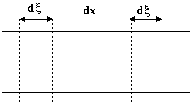
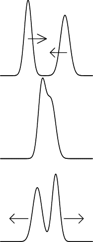
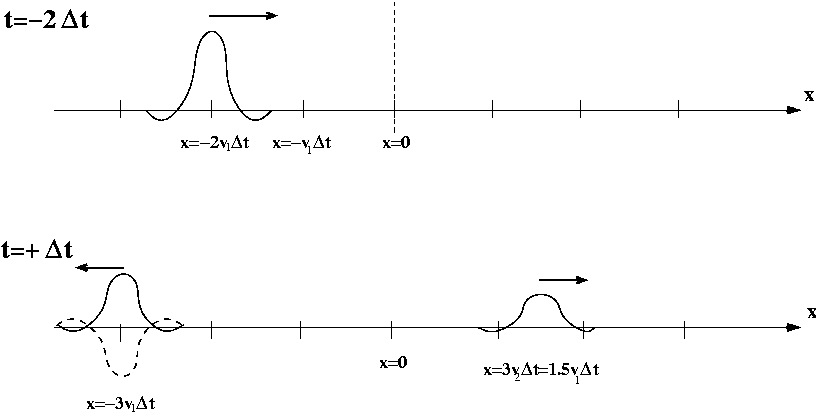
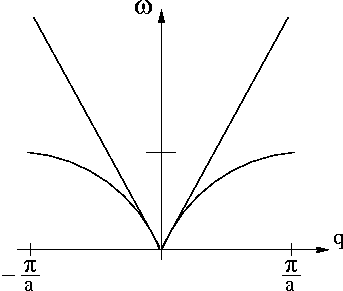
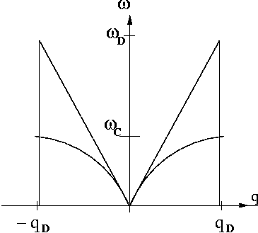

# Approximation de la chaı̂ne continue

## Equations du mouvement et solutions générales

### détermination de $\mathcal{J}$ et $\mathcal{C}$

- il est plus difficile de tordre de $\Delta\theta$ une petite portion de fil qu'une grande; le couple à appliquer doit être plus grand. La constante de torsion est alors inversement proportionnelle à la longueur du morceau considéré.
- On intègre entre $x$ et $x+a$ les quantités $\mathcal{J}dx$ puis $\frac{dx}{\mathcal{C}}$; on obtient :

    $$\mathcal{J}a = J$$

    $$\frac{a}{\mathcal{C}} = \frac{1}{C}$$

### équation d’onde - équation de d’Alembert

On considère une tranche $\mathcal{T}$ d'épaisseur $dx$.

<figure markdown>
  
</figure>

On détermine les couples exercés de part et d'autre par le reste de la chaîne en considérant deux morceaux d'épaisseur $d\xi$ de chaque côté.

Les tronçons compris entre $x-d\xi$ et $x$ et entre $x+dx$ et $x+dx+d\xi$ exercent respectivement  sur $\mathcal{T}$ les couples :

$$-\frac{\mathcal{C}}{d\xi}\Big[\theta(x,t)-\theta(x-d\xi,t)\Big] = -\frac{\mathcal{C}}{d\xi} \Big[d\xi\frac{\partial \theta}{\partial x}(x,t)\Big]$$

$$-\frac{\mathcal{C}}{d\xi}\Big[\theta(x+dx,t)-\theta(x+dx+d\xi,t)\Big] = \frac{\mathcal{C}}{d\xi} \Big[d\xi\frac{\partial \theta}{\partial x}(x+dx,t)\Big]$$

On peut simplifier par $d\xi$.

On applique le théorème du moment cinétique à cette tranche, on obtient :

$$\mathcal{J}dx \frac{\partial^2 \theta}{\partial t^2}(x,t) = \mathcal{C}\Big[-\frac{\partial \theta}{\partial x}(x,t)+\frac{\partial \theta}{\partial x}(x+dx,t)\Big] = \mathcal{C}dx \frac{\partial^2 \theta}{\partial x^2}(x,t)$$

On simplifie par $dx$ et l'on obtient l'équation de d'Alembert :

!!! eq "équation de d'Alembert"

    $$\frac{\partial^2 \theta}{\partial t^2}(x,t) - v^2 \frac{\partial^2 \theta}{\partial x^2}(x,t) = 0 \qquad avec \qquad v^2=\frac{\mathcal{C}}{\mathcal{J}}$$

### résolution

####
On peut considérer qu'il s'agit ici d'une question de cours; pour résoudre l'équation de d'Alembert on effectue le changement de variable suivant : $X = t - \frac{x}{v}$ et $Y = t + \frac{x}{v}$; $\theta(x,t)$ devient alors $\phi(X,Y)$.

On applique le théorème de composition des fonctions de plusieurs variables :

\begin{align*}
\frac{\partial \theta}{\partial t} & =  \frac{\partial \phi}{\partial X} \frac{\partial X}{\partial t} + \frac{\partial \phi}{\partial Y} \frac{\partial Y}{\partial t}  =   \frac{\partial\phi}{\partial X} + \frac{\partial\phi}{\partial Y}\\
\frac{\partial\theta}{\partial x} & =  \frac{\partial\phi}{\partial X} \frac{\partial X}{\partial x} + \frac{\partial \phi}{\partial Y} \frac{\partial Y}{\partial x}  =  - \frac{1}{v}\frac{\partial \phi}{\partial X} + \frac{1}{v}\frac{\partial\phi}{\partial Y}
\end{align*}

On continue pour obtenir les dérivées secondes :

\begin{align*}
\frac{\partial^2 \theta}{\partial t^2} & = & \frac{\partial^2 \phi}{\partial X^2} + 2\frac{\partial^2 \phi}{\partial X \partial Y} + \frac{\partial^2 \phi}{\partial Y^2} \\
 \frac{\partial^2 \theta}{\partial x^2} & = & \frac{1}{v^2} \Big[ \frac{\partial^2 \phi}{\partial X^2} - 2\frac{\partial^2 \phi}{\partial X \partial Y} + \frac{\partial^2 \phi}{\partial Y^2} \Big]
\end{align*}

Les deux dernières équations permettent d'écrire l'équation de d'Alembert en variables X, Y :

$$\frac{\partial^2 \phi}{\partial X \partial Y}=0$$

!!! remark "remarque"

    Pour mieux comprendre l'origine du changement de variable proposé par l'énoncé on peut s'apercevoir que l'équation de d'Alembert peut être réécrite sous la forme :
    
    $$\big( \frac{\partial}{\partial t} - v \frac{\partial}{\partial x} \big) \big( \frac{\partial}{\partial t} + v \frac{\partial}{\partial x} \big) \theta = 0$$ 

    Cela est possible car les opérateurs $\frac{\partial}{\partial t}$ et $\frac{\partial}{\partial x}$ commutent. On voit alors _apparaître_ l'interet des variables $t - \frac{x}{v}$ et $t + \frac{x}{v}$.

####
On intègre cette équation par rapport à $Y$ :

$$\frac{\partial \phi}{\partial X} = f(X)$$

En appelant $F(X)$ une primitive de $f(X)$ et en integrant par rapport à $X$ :

\begin{align*}
\phi(X,Y)  &= F(X) + G(Y) \\
\theta(x,t) &= F(t-\frac{x}{v}) + G(t+\frac{x}{v})
\end{align*}

$F$ et $G$ sont des fonctions dérivables d'_une seule variable_.

####
Par exemple, si $G$ est nulle $\theta (x,t) =  F(t-\frac{x}{v})$. On sait que mathématiquement la fontion $t \rightarrow h(t-t_0)$ a la même courbe représentative que la fonction $t \rightarrow h(t)$ mais translatée de $t_0$ le long de l'axe des $t$. Si l'on pose $t_0 = \frac{x}{v}$ on peut interpréter $F(t-\frac{x}{v})$ comme un signal se propageant vers les $x$ croissants.

<figure markdown>
  
</figure>

Finalement $\theta$ est la somme de deux signaux se propageant en sens inverse.

### densité linéique d’énergie mécanique

Considérons un tronçon de longueur $dx$ de la chaîne située 
entre les abscisses $x$ et $x+dx$.
Son énergie mécanique est la somme de deux termes :

- énergie cinétique : au premier ordre en $dx$, la vitesse de rotation est uniforme dans la tranche et est égale à $\frac{\partial \theta}{\partial t}(x,t)$; soit $dE_c = \frac{\mathcal{J}dx}{2} \big(\frac{\partial \theta}{\partial t}\big)^2(x,t)$
- énergie potentielle : c'est l'énergie que doit fournir un 
opérateur extérieur pour tordre réversiblement la tranche, 
c'est à dire l'opposé du travail des forces de torsion lors
 de l'opération suivante : l'angle en $x$ étant fixé à 
$\theta(x,t)$ on fait passer l'angle en $x+dx$ de $\theta(x,t)$ 
à $\theta(x+dx,t)$; on obtient $dE_p = - \int_{\theta(x,t)}^{\theta(x+dx,t)} \frac{\mathcal{C}}{dx}(\alpha - \theta(x,t))d\alpha$ soit,
au premier ordre en dx : $dE_p = \frac{\mathcal{C}dx}{2}\big(\frac{\partial \theta}{\partial x}\big)^2(x,t)$

On obtient l'expression de la densité linéique d'énergie :

$$\mathcal{E} = \frac{dE_c}{dx} + \frac{dE_p}{dx} = \frac{\mathcal{J}}{2} \big(\frac{\partial \theta}{\partial t}\big)^2(x,t) + \frac{\mathcal{C}}{2} \big(\frac{\partial \theta}{\partial x}\big)^2(x,t)$$

L'expression comporte deux termes quadratiques remarquablement symétriques; on passe de l'un à l'autre en changeant $\mathcal{J}$ en $\mathcal{C}$ et le temps en l'espace.

On dérive par rapport au temps :

$$\frac{\partial \mathcal{E}}{\partial t} = \mathcal{J} \frac{\partial \theta}{\partial t}
\frac{\partial^2 \theta}{\partial t^2} + \mathcal{C} \frac{\partial \theta}{\partial x}
\frac{\partial^2 \theta}{\partial t \partial x}$$

On utilise l'équation aux dérivées partielles du mouvement pour transformer le premier terme, alors :

$$\frac{\partial \mathcal{E}}{\partial t} = - \frac{\partial}{\partial x} \Big[ - \mathcal{C} \frac{\partial \theta}{\partial t} \frac{\partial \theta}{\partial x} \Big] = - \frac{\partial \mathcal{G}}{\partial x}$$

Ainsi $\mathcal{G}$ est définie, à une fonction du temps près, par :

$$\mathcal{G}(x,t) =  - \mathcal{C} \frac{\partial \theta}{\partial t} \frac{\partial \theta}{\partial x} + cste(t)$$

### interprétation physique

Il s'agit là d'une équation de continuité de l'énergie.
$\mathcal{G}(x,t)$ représente un flux d'énergie qui passe à travers une section du fil en $x$ (dans le sens des $x$ croissants) par unité de temps (ou encore la puissance transmise dans le sens des $x$ croissants si $\mathcal{G}(x,t)>0$ en $x$ à $t$).

En intégrant la relation sur une portion de fil de longueur $dx$, on peut écrire une équation de conservation de l'énergie.

Autres domaines de la physique :

- en électricité : $div \overrightarrow{j_{elec}} + \frac{\partial \rho}{\partial t} = 0$ ([conservation de la quantité de charge](https://fr.wikipedia.org/wiki/Conservation_de_la_charge_%C3%A9lectrique))
- en mécanique des fluides : $div \overrightarrow{j} + \frac{\partial \rho}{\partial t} = 0$ ([conservation de la quantité de matière](https://fr.wikipedia.org/wiki/Conservation_de_la_mati%C3%A8re))
- en électro-magnétisme : $div \overrightarrow{\pi} + \overrightarrow{j}.\overrightarrow{E} + \frac{\partial \omega}{\partial t} = 0$ (conservation de l'énergie électromagnétique, [théorème de Poynting](https://fr.wikipedia.org/wiki/Th%C3%A9or%C3%A8me_de_Poynting))

### cas particulier d’une onde allant dans le sens des $x$ croissants

$\theta(x,t) = F(t-\frac{x}{v})$

On vérifie aisément que les densités d'énergie cinétique et élastique sont égales :

$$\mathcal{E}_c(x,t) = \mathcal{E}_{el}(x,t) = \frac{\mathcal{J}}{2} \Big[ F'(t-\frac{x}{v}) \Big]^2 ,\,\,\,\, \forall t,x$$

On obtient alors :

$$\mathcal{G}(x,t) = v \mathcal{E}(x,t), \,\,\,\, \forall t,x$$

### cas particulier d’une onde allant dans le sens des $x$ decroissants

Il suffit de changer $x$ en $-x$ dans les expressions précédentes; on obtient :

$$\mathcal{E}_c(x,t) = \mathcal{E}_{el}(x,t) = \frac{\mathcal{J}}{2} \Big[ G'(t+\frac{x}{v}) \Big]^2 ,\,\,\,\, \forall t,x$$

et

$$\mathcal{G}(x,t) = -v \mathcal{E}(x,t) ,\,\,\,\, \forall t,x$$

On constate ainsi que l'on a inversé le sens du flux d'énergie en changeant le sens de progation de l'onde.

### cas général

Etant donnée la solution générale  $\theta(x,t) = F(t-\frac{x}{v}) + G(t+\frac{x}{v})$ après quelques calculs simples il reste :

$$\mathcal{E}(x,t) =  \mathcal{J} \Big( F'(t-\frac{x}{v}) \Big)^2 + \mathcal{J} \Big( G'(t+\frac{x}{v}) \Big)^2$$

et

$$\mathcal{G}(x,t) =  \mathcal{J}v \Big( F'(t-\frac{x}{v}) \Big)^2 - \mathcal{J}v \Big( G'(t+\frac{x}{v}) \Big)^2$$

On constate que lorsque deux signaux se propagent en sens inverse sur le fil :

- les densités linéiques d'énergie mécanique (respectives) s'ajoutent.
- les flux (algébriques) d'énergie transportée  se retranchent.

## traversée d’une discontinuité

### cas d’une onde se propageant vers les $x$ croissants

On considère une onde _incidente_ décrite par :

$$\theta_i (x,t) = F(t-\frac{x}{v_1})$$

- en $x=0$, on change de milieu de propagation; on peut donc s'attendre à des phénomènes de réflexion et réfraction.

- analogies

        - [en optique] (et plus généralement en électro-magnétisme) lorsqu'une onde lumineuse rencontre une surface séparant deux milieux d'indices différents.
        - [en mécanique des fluides :] onde de surface se propageant dans un canal (voir sujet X93 M' et P'), ...
        - [en acoustique :] corde vibrante, tube sonore, ultrason (échographie médicale), ...

- dioptre

- conditions aux limites
    - en $x= + \infty$ : on suppose qu'il n'y a pas de source qui excite la corde en torsion, donc $K = 0$.
    - en $x = 0$ : le fil ne se déchire pas; $\theta$ est continu (1) et le flux d'énergie se conserve (2) :

    \begin{align}
    F(t) + G(t) &= H(t) \\
    \mathcal{J}_1 v_1 (F'(t))^2 - \mathcal{J}_1 v_1 (G'(t))^2 &= \mathcal{J}_2 v_2 (H'(t))^2
    \end{align}

### résolution

- expression de $G$ et $H$

    * On dérive (1) : $F'+G' = H'$
    * On factorise (2) : $z_1 (F'+G')(F'-G') = z_2 H^{'2}$

On résout en fonction de $F'(t)$ puis on intègre :

\begin{align*}
G'(t)= \frac{z_1-z_2}{z_1+z_2}F'(t)\\
H'(t)= \frac{2z_1}{z_1+z_2}F'(t)
\end{align*}

soit

\begin{align*}
G(t)= \frac{z_1-z_2}{z_1+z_2}F(t)+C_1\\
H(t)= \frac{2z_1}{z_1+z_2}F(t)+C_2
\end{align*}

La relation (1) impose $C_1=C_2$; d'autre part on peut choisir $C_1=C_2=0$ cela revient à changer l'origine de $\theta$, soit :

\begin{align*}
G(t)= \frac{z_1-z_2}{z_1+z_2}F(t)\\
H(t)= \frac{2z_1}{z_1+z_2}F(t)
\end{align*}

- coefficients de réflexion et de transmission en amplitude

en $x=0$ :

\begin{align*}
r_{12} = \frac{G(t)}{F(t)} = \frac{z_1-z_2}{z_1+z_2}\\
t_{12} = \frac{H(t)}{F(t)} = \frac{2z_1}{z_1+z_2}
\end{align*}

- signe de $r_{12}$

     * si $z_2 \rightarrow 0$

\begin{align*}
r=1 & & \mathcal{G}_r = z_1 {G'}^2 = z_1 {F'}^2 = \mathcal{G}_i\\
t=2 & & \mathcal{G}_t = z_2 {H'}^2 = 0
\end{align*}
    
Il n'y a pas de puissance transmise dans le milieu $2$!  
Comme $z_2 = \sqrt{\mathcal{J}_2 \mathcal{C}_2 }$ cela signifie que $\mathcal{C}_2$ tend vers zero (ou $\mathcal{C}_2$) : tout se passe comme s'il n'y avait pas de fil dans le milieu 2!! Soit encore, comme si l'extremité en $x=0$ du fil du milieu 1 était libre. Lorsque l'énergie incidente arrive en $x=0$, elle ne peut être transmise, elle est entièrement réfléchie.

- signe de $r_{12}$

     * si $z_2 \rightarrow \infty$

\begin{align*}
r= -1  & \rightarrow & \mathcal{G}_r = z_1 {G'}^2 = z_1 {F'}^2 = \mathcal{G}_i\\
t= 2   & \rightarrow & \mathcal{G}_t = z_2 {H'}^2 = 0
\end{align*}
    
Il n'y a pas de puissance transmise dans le milieu $2$!

Comme $z_2 = \sqrt{\mathcal{J}_2 \mathcal{C}_2 }$ devient infini, cela signifie que le milieu devient infiniment inerte ( $\mathcal{J}_2 \to \infty$) ou infiniment rigide ( $\mathcal{C}_2 \to \infty$); dans tous les cas, le fil du milieu $2$ est immobile, en particulier en $x=0$.

Lorsque $z_1 = z_2$, on dit qu'il y a adaptation d'impédance car la puissance transmise ($\mathcal{G}_t$) est égale à la puissance incidente ($\mathcal{G}_t$); la puissance réfléchie étant nulle. Du point de vue du transfert énergétique tout se passe comme si on avait qu'un seul milieu de propagation. C'est idéal!

- analogies

Le même changement de signe pour la réflexion d'une OEM sur un dioptre séparant deux milieux d'indice optique $n_1$ et $n_2$ :

$$r_{12}=\frac{\big\| \overrightarrow{E_r} (z=0,t) \big\|}{\big\| \overrightarrow{E_r} (z=0,t) \big\|} = \frac{n_1-n_2}{n_1+n_2}$$

### étude énergétique

- coefficients $R_{12}$ et $T_{12}$  
  On définit ces deux coefficients à l'aide de la puissance transportée associée à chacun des signaux :
  
\begin{align*}
R_{12} &=\frac{\mathcal{G}_r (0_-,t)}{\mathcal{G}_i (0_-,t)} &= \frac{v_1 \mathcal{J}_1 G^{'2}}{v_1 \mathcal{J}_1 F^{'2}} &= \big( \frac{G'(t)}{F'(t)} \big)^2 &= \big( \frac{G(t)}{F(t)} \big)^2 &=r_{12}^2\\
T_{12} &=\frac{\mathcal{G}_t (0_+,t)}{\mathcal{G}_i (0_-,t)} &= \frac{v_2 \mathcal{J}_2 H^{'2}}{v_1 \mathcal{J}_1 F^{'2}} &= \frac{z_2}{z_1}\big( \frac{H'(t)}{F'(t)} \big)^2 &= \frac{z_2}{z_1}\big( \frac{H(t)}{F(t)} \big)^2 &= \frac{z_2}{z_1} t_{12}^2
\end{align*}

- en fonction de $z_1$ et $z_2$ :

\begin{align*}
R_{12} &= \big(\frac{z_1-z_2}{z_1+z_2}\big)^2\\
T_{12} &= \frac{4 z_1 z_2}{(z_1+z_2)^2}
\end{align*}

- conservation du flux d'énergie en $x=0$ :

$$R_{12}+T_{12}=1$$

### étude qualitative de la traversée du dioptre

<figure markdown>
  
  <figcaption></figcaption>
</figure>

Sur la figure du dessus, on observe une impulsion incidente à t=-2$\Delta$t, et sur la figure du dessous, on a les impulsions réfléchie et transmise à t=3$\Delta$t

La courbe en pointillés correspond au cas où $z_2 > z_1$, i.e. $r_{12}<0$.

- cas où $z_1=z_2$ :

    On a $r_{12}=0$ et $t_{12}=1$ : il n'y a pas de réflexion, le signal incident est entièrement transmis sans déformation. Tout se passe comme s'il n'y avait qu'un seul milieu de propagation; on parle du phénomène d'**adaptation d'impédance**.

## Modes propres de la chaı̂ne continue

### solutions propagatives

- solution en ondes progressives :

On cherche des solutions de la forme $\mathcal{R}e(A e^{i(qx-\omega t)})$
Cette fonction convient si et seulement si :

\begin{align*}
\frac{\partial^2 \theta}{\partial t^2} -v^2 \frac{\partial^2 \theta}{\partial x^2} = (-\omega^2+v^2q^2)Ae^{i(qx-\omega t)} = 0
\end{align*}

Il reste la condition :

\begin{align*}
\omega^2 = v^2 q^2&, & \forall q
\end{align*}

- relation de dispersion du modèle continu :

<figure markdown>
  
  <figcaption>Relation de dispersion du modèle continu.</figcaption>
</figure>

\begin{align*}
\omega= f_c(q) = v|q| = \sqrt{\frac{\mathcal{C}}{\mathcal{J}}}|q|
\end{align*}

En I-1-6-a on avait :

\begin{align*}
\omega= f(q) =2\sqrt{\frac{C}{J}}|\sin \frac{qa}{2}|
\end{align*}

Effectuons un développement limité au voisinage de $q=0$ de $f(q)$ :

\begin{align*}
f(q) \sim_{q \rightarrow 0^{+}} 2\sqrt{\frac{C}{J}}  \frac{qa}{2} = \sqrt{\frac{\mathcal{C}}{\mathcal{J}}}q = f_c(q)
\end{align*}

on montre ainsi que les deux courbes sont tangentes en $q=0$.

### comparaison des modèles chaı̂ne discrète et chaı̂ne continue

- $f_c$ n'est pas périodique en $q$. La première zone de Brillouin est transformée en un _V_.

- Faisons tendre le pas élémentaire $a$ de la chaîne discrête vers 0 et développons $f(q)$ au premier ordre en a (pour $q>0$ fixé) :

\begin{align*}
f(q) \simeq  2\sqrt{\frac{C}{J}} \frac{qa}{2}  \simeq \sqrt{\frac{\frac{\mathcal{C}}{a}}{\mathcal{J}a}} qa \simeq \sqrt{\frac{\mathcal{C}}{\mathcal{J}}} q \simeq f_c(q)
\end{align*}

- Réécrivons chacun des termes de l'équation de propagation discrète en développant à l'ordre deux en $a$ :

\begin{align*}
\theta_n-\theta_{n-1} &= \theta(x=na,t)-\theta(x=(n-1)a,t) \simeq_{a \rightarrow 0} a \frac{\partial \theta}{\partial x}(x,t) - \frac{a^2}{2} \frac{\partial^2 \theta}{\partial x^2}(x,t) \\
\theta_n-\theta_{n+1} &= \theta(x=na,t)-\theta(x=(n+1)a,t) \simeq_{a \rightarrow 0} -a \frac{\partial \theta}{\partial x}(x,t) - \frac{a^2}{2} \frac{\partial^2 \theta}{\partial x^2}(x,t)
\end{align*}

\begin{align*}
J \frac{d^2\theta_n}{dt^2} = J  \frac{\partial^2\theta}{\partial t^2}
\end{align*}

L'équation discrète devient alors :

\begin{align*}
J  \frac{\partial^2\theta}{\partial t^2} - C a^2 \frac{\partial^2\theta}{\partial x^2} = 0
\end{align*}

Soit finalement, en divisant par $a$:

\begin{align*}
\frac{\partial^2\theta}{\partial t^2} - v^2 \frac{\partial^2\theta}{\partial x^2} = 0
\end{align*}

### chaı̂ne continue de longueur finie

- Le résultat de I-2-1-a reste vrai ici : l'équation de propagation continue est valable pour la chaîne refermée sur elle-même.

La condition BVK permet d'obtenir les vecteurs d'onde propres :

\begin{align*}
\theta(x+L,t)=\theta(x,t) & \Rightarrow & e^{iqL}=1 : qL \equiv 0 \pmod{2\pi}
\end{align*}

\begin{align*}
q_m = \frac{2\pi}{L}m &,& m \in \mathbb{Z}
\end{align*}

$q$ appartient au même ensemble discret qu'en I-2-1-a en remplacant $N a$ par $L$.

- On retrouve les résultats de la première partie : $N$ valeurs de $q$ dans l'intervalle $\big] -\frac{N\pi}{L} , \frac{N\pi}{L} \big]$.

### modèle de Debye

<figure markdown>
  
  <figcaption>Relation de dispersion du modèle Debye.</figcaption>
</figure>

On tronque la relation de dispersion à l'intervalle  $\big] -\frac{N\pi}{L} , \frac{N\pi}{L} \big]$.

- $\omega_D = \frac{\pi}{a} v$

- $\omega_D = \frac{\pi}{2}\omega_c$

$f_D(q)$ est la tangente à l'origine de $f(q)$ qui est un sinus; cela explique le facteur $\frac{\pi}{2}$.

### validité du modèle de Debye

- $\lambda_D = \frac{2\pi}{q_D} = 2a$

- Le problème réside dans le fait que la description continue de la chaîne utilise une loi linéaire $\omega = v |q|$ dans la zone de Brillouin alors que les phénomènes ne le sont pas.

  La description continue de la chaîne discrète est acceptable au voisinage de $qa=0$ (au milieu de la zone de Brillouin) où les deux relations de dispersion sont tangentes.

- Le modèle de Debye donne des solutions $F(t-\frac{x}{v})$ qui représente des signaux se propageant sans se déformer (l'amplitude et la forme de $F$ restent les mêmes). Pour que ces solutions décrivent correctement les ondes observées sur la chaîne discrète il faut $qa << 1$, c'est à dire que l'extension spatiale $\Delta x$ vérifie : $\Delta x \gg a$ et  $\Delta t \gg \frac{a}{v}.$

## Etude du comportement d’un paquet d’onde

### propagation sans déformation

Dans le modèle de Debye, une onde progressive se dirigeant vers les $x$ croissants est décrite mathématiquement par : $F(t-\frac{x}{v})$ où $F$ est une fonction d'une seule variable déterminée une fois pour toute au moment de l'émission en bout de chaîne ($x \rightarrow - \infty$). $F$ ne change pas au cours de la propagation : il n'y a pas de déformation.

### expression mathématique de la propagation sans déformation

- Utilisons la relation de dispersion du modèle de Debye : $\omega = vq$ pour $q>0$; alors :

\begin{align*}
\theta(x,t) = \mathbb{R}e \Big\{ \int_{0}^{q_D} dq \mathcal{A}(q)e^{iq(x-vt)} \Big\}
\end{align*}

Soit

\begin{align*}
\theta(x,t) = F(x -vt) & \,\,\,\,\,\text{avec} & F(X) =   \mathbb{R}e \Big\{ \int_{0}^{q_D} dq \mathcal{A}(q)e^{iqX} \Big\}
\end{align*}

- la phase associée au vecteur d'onde $q$ est $q(x-vt)$
- la phase associée au vecteur d'onde $q'$ est $q'(x-vt)$

Pour que ces deux vecteur d'onde soient en phase, quelques soient $q$ et $q'$ choisis dans le paquet d'onde, il est nécessaire et suffisant que $x-vt=0$, soit $x(t)=vt$.

### centre du paquet d’onde

- Le centre du paquet d'onde (et donc le paquet d'onde lui-même) est en mouvement uniforme de translation. 

- $v_g = v_{\phi} = v$ : tous les composantes du paquet ont des phases qui se déforment au même rythme (à la vitesse de phase).

### réflexion - transmission d’une onde incidente sinusoı̈dale

On considère l'onde incidente :

\begin{align*}
\theta_i = B_i e^{-i\omega_0(t-\frac{x}{v})}
\end{align*}

La présence du _dioptre_ en $x=0$ donne naissance à une onde refléchie et une onde transmise dont on calcule les amplitudes; on détermine ensuite les expressions complètes de ces deux ondes :

\begin{align*}
\theta_r(0^{-},t) = r_{12} \theta_i(0^{-},t) = r_{12} B_i e^{-i\omega_0t} \Rightarrow \theta_r(x,t) = r_{12} B_i e^{-i\omega_0(t+\frac{x}{v})} \qquad \forall x \leq 0\\
\theta_t(0^{+},t) = t_{12} \theta_i(0^{-},t) = t_{12} B_i e^{-i\omega_0t} \Rightarrow \theta_t(x,t) = t_{12} B_i e^{-i\omega_0(t-\frac{x}{v})} \qquad \forall x \geq 0
\end{align*}

On déduit la solution complète :

!!! eq "solution"

    \begin{align*}
    \text{si}\,\,\, & x \leq0 : & \theta (x,t) & = (\theta_i + \theta_r)(x,t) & = & B_i e^{-i\omega_0t} \big[ e^{i\omega_0\frac{x}{v}} + r_{12} e^{-i\omega_0\frac{x}{v}} \big] \\
    \text{si}\,\,\, & x \geq0 : & \theta (x,t) & = \theta_t (x,t) & = &  B_i e^{-i\omega_0t} t_{12} e^{i\omega_0\frac{x}{v}}.
    \end{align*}

### réflexion - transmission d’un paquet d’onde quelconque

- le paquet d'ondes sinusoïdales peut s'écrire, après avoir effectué le changement de variable  $\omega = qv$ :

\begin{align*}
\theta(x,t) = \mathbb{R}e \Big\{ \int_{0}^{\omega_D} d\omega \mathcal{B}_i(\omega)e^{i\big(q(\omega)x-\omega t \big)} \Big\}
\end{align*}

en ayant posé : $\mathcal{B}_i(\omega) = \frac{\mathcal{A}(\frac{\omega}{v})}{v}$.

- L'équation de propagation est linéaire : cela signifie que la solution $\theta(x,t)$ est la somme des solutions engendrées par chacune des ondes sinusoïdales du paquet d'onde incident. On procède de la même manière qu'à la question précédente : on détermine les amplitudes des ondes réfléchie et transmises sachant que les coefficients de réflexion et transmission sont indépendants de $\omega$:

\begin{align*}
\theta_r(0^{-},t) = r_{12} \theta_i(0^{-},t) = r_{12}  \int_0^{\omega_D} \mathcal{B}_i(\omega) e^{-i\omega t} \Rightarrow \theta_r(x,t) =  r_{12}  \int_0^{\omega_D} \mathcal{B}_i(\omega) e^{-i\omega (t +\frac{x}{v}) }  \qquad \forall x \leq 0\\
\theta_t(0^{+},t) = t_{12} \theta_i(0^{-},t) = t_{12}  \int_0^{\omega_D} \mathcal{B}_i(\omega) e^{-i\omega t} \Rightarrow \theta_t(x,t) =  t_{12}  \int_0^{\omega_D} \mathcal{B}_i(\omega) e^{-i\omega (t -\frac{x}{v}) }  \qquad \forall x \geq 0
\end{align*}

On obtient finalement :

!!! eq "solution"

    \begin{align*}
    \text{si}\,\,\, & x \leq0  : & \theta(x,t) & =  \mathbb{R}e \Big\{ \int_0^{\omega_D} d\omega \mathcal{B}_i(\omega) e^{-i\omega t} \big[ e^{i\omega\frac{x}{v}} + r_{12} e^{-i\omega\frac{x}{v}} \big] \Big\} \\
    \text{si}\,\,\, & x \geq0  : & \theta(x,t) & =  \mathbb{R}e \Big\{ \int_0^{\omega_D} d\omega \mathcal{B}_i(\omega) e^{-i\omega t} t_{12} e^{i\omega\frac{x}{v}} \Big\}.
    \end{align*}

- Le paquet d'onde incident se translate, à vitesse constante, dans le sens des $x$ croissants. On le suppose d'extension temporelle $\Delta t$. A la date $t=-\frac{\Delta t}{2}$, le front du paquet arrive en $x=0$ : la réflexion et la transmission commencent.

- Supposons $\mathcal{B}_i(\omega)$ non nul dans la bande de pulsations comprises entre $\omega_0-\frac{\Delta \omega}{2}$ et $\omega_0+\frac{\Delta \omega}{2}$. Supposons que le centre du signal à $t=t_0$ soit en $x_0$ : toutes les ondes du paquet sont en phase.

Le signal en $x_0$ devient nul quand toutes les ondes se sont déphasées, c'est à dire à la date $t=t_0+\Delta t$ où $\Delta t$ est la durée de l'impulsion. A cette date, les phases des ondes du paquet sont réparties uniformément entre $0$ et $2\pi$ :

\begin{align*}
(\omega_0-\frac{\Delta \omega}{2})\Delta t -  (\omega_0+\frac{\Delta \omega}{2})\Delta t = 2\pi
\end{align*}

soit

\begin{align*}
\Delta \omega \Delta t = 4\pi
\end{align*}

L'extension spatiale du paquet est alors : $\Delta x = v\Delta t = \frac{4\pi v}{\Delta \omega}$

A la limite pour un signal monochromatique, on retrouve une extension spatiale infinie.

Au retrouve ainsi une expression du [principe d'Heisenberg](https://fr.wikipedia.org/wiki/Principe_d%27incertitude), vue ici comme une propriété fondamentale de la [transformation de Fourier](https://fr.wikipedia.org/wiki/Transformation_de_Fourier).
