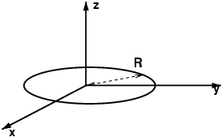
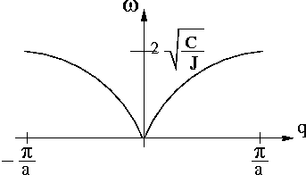

# Modes propres de torsion

## Chaîne discrète infinie

<figure markdown>
  
  <figcaption>dique en symétrie cylindrique</figcaption>
</figure>

### Moment d'inertie

On calcule le [moment d'inertie](https://fr.wikipedia.org/wiki/Moment_d%27inertie) d'un disque homogène de densité surfacique $\sigma = \frac{M}{\pi R^{2}}$
par rapport à son centre; on rappelle que l'élément de masse en coordonnées polaire est $dm = \sigma rd\theta dr$, on obtient alors le moment d'inertie

$$J = \int\int_{D} OM^{2} d^{2}m = \int_{0}^{2\pi}d\theta \int_{0}^{R} r^3\sigma dr = \frac{MR^{2}}{2}$$

### équation du mouvement

On se place dans le référentiel attaché au fil; le disque numéro $n$ est soumis aux forces extérieures suivantes :

- le poids : moment en $G_n$ nul
- la réaction du fil : moment en $G_{n}$ nul
- les torsions exercées par les troncons de fil de part et d'autre de $G_n$

On applique le [théorème du moment cinétique](https://fr.wikipedia.org/wiki/Th%C3%A9or%C3%A8me_du_moment_cin%C3%A9tique) en $G_n$

$$\Big( \frac{d}{dt}\overrightarrow{\sigma_{G_n}} \Big)_{\mathcal{R}} = \sum \overrightarrow{\mathcal{M}_{G_n}}
$$

On projette la relation sur l'axe du fil, il ne reste que le [couple](https://fr.wikipedia.org/wiki/Couple_(physique)) des forces de torsion :

$$J\ddot{\theta_n} = - C(\theta_n - \theta_{n-1}) - C(\theta_n - \theta_{n+1})$$

!!! eq "équation du mouvement"

    $$J\ddot{\theta_n} + C(2\theta_n - \theta_{n-1}  - \theta_{n+1}) = 0$$

Le mouvement du disque $D_n$ dépend de ceux de $D_{n-1}$ et $D_{n+1}$. 

### énergie mécanique totale

On choisit de l'origine des énergies potentielles quand la chaîne est totalement relâchée ($\forall n \in \mathbb{N}, \theta_n=0$).

Calculons l'énergie que doit dépenser réversiblement un opérateur pour tordre chaque disque, respectivement, d'un angle $\theta_n$.
Supposons que tous les disques situés avant $D_n$ ont été tordus et que $D_n$ et les suivants sont encore relâchés; pour tordre $D_n$ d'un angle $\theta_n$, un opérateur doit exercer réversiblement une force dont le travail est  l'énergie potentielle :

$$W_{op} = E_p(n) = -W_{(\textrm{forces de torsion})} = - \int \Gamma d\theta$$

$$W_{op} = - \int_{0}^{\theta_n} \Big[ -C(\theta-\theta_{n-1}) -  C(\theta-0) \Big] d\theta = C\theta_n^{2} - C\theta_n\theta_{n-1}$$

L'énergie cinétique du disque $D_n$ est $E_c(n) = \frac{J}{2} \Big(\frac{d\theta_n}{dt}\Big)^2$.

Finalement l'énergie mécanique totale de la chaîne s'écrit :

!!! eq "énergie mécanique totale"

    $$E = \sum_{n \in \mathbb{Z}} \left[ E_c(n) + E_p(n) \right] =  \sum_{n \in \mathbb{Z}} \Big[ \frac{J}{2} \dot{\theta_n}^2 + C\theta_n^2 + C\theta_n\theta_{n-1} \Big]$$

Cette somme, nécessairement convergente, est égale à l'énergie injectée dans le système (par exemple en bout de chaîne à l'aide d'un moteur électrique).

### recherche de solutions ondulatoires

Sachant que $\dot \theta_n = (-i\omega) \theta_n$ et que $\ddot \theta_n = (-i\omega)^2 \theta_n$, on renvoie la solution proposée par l'énoncé dans l'équation du mouvement. Après simplifications, on obtient la condition suffisante d'existence des solutions :

!!! eq "relation de dispersion"

    $$\omega = 2\sqrt{\frac{C}{J}} |\sin \frac{qa}{2}|$$

Le système formé des équations du mouvement de chaque disque exprime l'action de proche en proche que peut exercer chaque maillon sur ces voisins. Si l'on tord un maillon, il entraîne son voisin, puis celui-ci entraîne le suivant, etc...

Une impulsion est succeptible de se propager le long de la chaîne.

Supposons que l'on impose à l'un des maillons un mouvement vibratoire sinusoidal (à l'aide d'un petit moteur électrique). Après amortissement des effets transitoires liés à la mise en marche de l'excitateur, le mouvement de chaque maillon doit également être sinusoidal de _même fréquence, même amplitude_ car rien ne distingue les chaînons les uns des autres : l'énergie ne subit aucune absorption à mesure que l'on s'éloigne de la source excitatrice.

Il était donc raisonnable de proposer des solutions qui sont le produit d'un terme purement oscilatoire : $e^{-i\omega t}$ avec un terme de déphasage : $e^{qx_n}$ qui dépend de la position $x_n$.

### étude de la relation de dispersion (symétrie par translation)

- la fonction $\omega = f(q)$ est périodique de période : $G=\frac{2\pi}{a}$

<figure markdown>
  
  <figcaption>Relation de dispersion</figcaption>
</figure>

- Si l'on change $q$ par $q+pG$ la pulsation reste la même $\omega(q+pG) = \omega(q) = \omega$ et on vérifie ensuite que la solution est invariante:

$$\forall n \in \mathbb{Z}, e^{i\big[(q+pG)x_n-\omega t\big]} = e^{i(qx_n-\omega t)} = \theta_{n}(t)$$

- Cette invariance est dûe au fait que la chaîne est discrète (il y a une longueur caractéristique minimale qui est le pas $a$).

Parlons en terme de longueur d'onde (grandeur physique plus intuitive). La plus petite longueur d'onde observable "physiquement" est $a$. Considérons une solution telle que $q = q_0 + pG$ (p entier)  soit $|q| > \frac{G}{2}$ c'est à dire qui aurait une longueur d'onde inférieure à $a$ (donc non observable physiquement).

La longueur d'onde mesurée (physique ou effective) est inférieure à $a$.
Pour une étude physique, on peut donc se restreindre à la zone de Brillouin : $\rbrack \frac{G}{2}, \frac{G}{2} \rbrack$.

### vitesse de phase et vitesse de groupe

- vitesse de phase : c'est la vitesse de déplacement des surfaces équiphases (pour le calcul
on plonge la variable d'espace dans un espace continu : $x \in \mathbb(R)$)

$$d(qx-wt)_{q=cste}=0 \Rightarrow v_{\phi} = \frac{dx}{dt} = \frac{\omega(q)}{q}$$

!!! eq "vitesse de phase"

    $$v_{\phi}(q) = 2\sqrt{\frac{C}{J}} \frac{| \sin \frac{qa}{2} |}{q}$$

- vitesse de groupe : c'est la vitesse de propagation de l'énergie, $v_g = | \frac{d\omega}{dq} |$

!!! eq "vitesse de groupe"

    $$v_g = a\sqrt{\frac{C}{J}}|\cos\frac{qa}{2}|$$

Ces deux vitesses étant différentes, on dit que le milieu de propagation est dispersif.

### étude du centre de la zone de Brillouin ($| \frac{qa}{2} | \ll 1$)

- $v_{\phi} \simeq  a \sqrt{\frac{C}{J}}$ et $v_g \simeq a \sqrt{\frac{C}{J}}$
- $\frac{\theta_{n+1}(t)}{\theta_n(t)} = e^{iqa} \simeq 1$ : deux disques consécutifs sont pratiquement en phase.
- tous les disques vibrent en phase, c'est un mouvement en bloc. En effet, comme $q$ est défini modulo $G$, la condition : $\frac{q}{a} \ll 1$ revient à considérer $q \approx \frac{2\pi}{a}$ soit une longueur d'onde de $a$ (mouvement en bloc).

### étude du bord de la zone de Brillouin ($q = G/2$)

- $\frac{\theta_{n+1}(t)}{\theta_n()t} = e^{iqa} = e^{i\pi} = -1$ : deux disques consécutifs sont en opposition de phase.

- l'état physique est inchangé car $\frac{G}{2}$ et $-\frac{G}{2}$ diffèrent d'une période.

- la vitesse de groupe vaut $v_g = a\sqrt{\frac{C}{J}} | \cos \frac{\pi}{a}.\frac{a}{2} | = 0$ : l'énergie ne se déplace pas, elle oscille sur place, dans chaque cellule élémentaire.

### bande de fréquences permises

- $\omega_c = 2\sqrt{\frac{C}{J}}$.

- l'énoncé suggère de considérer le cas où $\theta_{n+1}=-\theta_n$ et de réécrire l'équation de propagation, on obtient :

$$\frac{d^2\theta_n}{dt^2} + \omega^2\theta_n = 0$$

avec $\omega^2=4\frac{C}{J}$

Comment comprendre l'existence d'une fréquence de coupure ?
On peut raisonner sur l'énergie du système pour étudier le bord de la zone de Brillouin.

Considérons l'énergie mécanique d'un maillon :

$$E_n = E_c(n) + E_p(n) =  \frac{J}{2} \dot{\theta_n}^2 + C\theta_n^2 + C\theta_n\theta_{n-1}$$

que l'on peut réécrire en symétrisant le terme d'énergie potentielle :

$$E_n = E_c(n) + E_p(n) =  \frac{J}{2} \dot{\theta_n}^2 + \frac{C}{2} \big( \theta_n - \theta_{n-1} \big)^2$$

En prenant $\theta_n = A \cos \omega t$ et $\theta_{n+1} = A \cos (\omega t + \phi)$ avec $\phi = qa$, on calcule $E_c(n)$ et $E_p(n)$ :

$$E_c(n)  =  \frac{JA^2}{2} \omega^2 \sin^2 \omega t$$

$$E_p(n)  =  2CA^2 \sin^2 \frac{\phi}{2} \sin^2 (\omega t + \frac{\phi}{2})$$

Le mouvement de torsion se transmet de proche en proche (à partir d'une source) grâce à la conversion de l'énergie cinétique en énergie potentielle de torsion.

On remarque que $E_c(n)$ a une amplitude qui augmente avec $\omega$, tandis que celle de $E_p(n)$ vaut au maximum $2C$.

Lorsque $\omega$ est faible, une **onde plane progressive** peut se propager : la longeur d'onde s'adapte pour que l'amplitude de $E_p(n)$ soit la même que celle de $E_c(n)$. On retrouve ainsi la relation de dispersion. Toute l'énergie injectée est transmise.

- Si on injecte de l'énergie cinétique avec une pulsation égale à $\omega_c = 2 \sqrt{\frac{C}{J}}$, alors $E_c(n)$ et $E_p(n)$ oscillent en phase, l'énergie oscille sur place, l'onde est **stationnaire**.

- Si on injecte de l'énergie cinétique avec une pulsation supérieure à $\omega_c$, alors l'énergie potentielle ayant une amplitude bloquée à $2C$, elle ne peut absorber toute l'énergie cinétique et la restituer au maillon suivant : l'amplitude du mouvement diminue d'un maillon au suivant, l'onde est dite **amortie**.

On voit ainsi apparaître la coupure fondamentale à $\omega_c$, qui est dûe au fait que le fil de longueur $a$ ne peut pas transmettre des énergies aussi grandes que l'on veut. Cela disparaîtra quand on étudiera le modèle de torsion continue.

## Variables normales et modes propres de torsion

On étudie à présent une chaîne finie (N chaînons) bouclée sur elle-même. C'est la façon la plus simple de traiter les effets de bord périodiques. Les solutions des équations du mouvements devront donc satisfaire la relation suivante :

$$\forall n \in \mathbb{Z} ,  \theta_{n+N}(t) = \theta_n(t)$$

### recherche de solutions en ondes progressives

- L'équation du mouvement est encore valable et donc la relation de dispersion également. (Mathématiquement on ne fait que modifier les conditions aux limites sans toucher au système des équations du mouvement). La condition de BVK impose que : $e^{iqNa} = 1$ soit $q_m = \frac{2\pi}{Na}m $ où $m \in \mathbb{Z}$.

- $q$ devient une variable discrète avec $q_m = m q_1$ et $q_1 = \frac{2\pi}{L}$.
Il s'agit de solutions ondulatoires dont la longueur d'onde $\lambda$ est $\frac{L}{m}$ : un sous-multiple de la longueur d'un chaînon.

- On cherche $m$ tel que : $-\frac{G}{2} < q_m \leq \frac{G}{2} \Leftrightarrow -\frac{N}{2} < m \leq \frac{N}{2}$
    * si N pair : $N = 2 N_1 \Rightarrow -N_1 < m \leq N_1$  
      $m = -N_1+1, -N_1+2,...,0,1,...,N_1 \qquad$ soit $\qquad 2N_1=N$ valeurs.
    * si N impair  $N = 2 N_1-1 \Rightarrow -N_1+\frac{1}{2} < m \leq N_1-\frac{1}{2}$  
      $m = -N_1+1, -N_1+2,...,0,1,...,N_1-1 \qquad$ soit $\qquad 2N_1-1=N$ valeurs.

CQFD.

Dans tous les cas il y a $N$ valeurs possibles de $q$ dans $\Big]-\frac{G}{2},\frac{G}{2}\Big]$

### variables normales

- L'énoncé nous dit 
  !!! quote
      
        ... L'existence des solutions en ondes progressives (...) suggère d'introduire (un)
        nouveau jeu de variable, dites normales....
    
    En effet, on peut faire une petite analogie avec l'algèbre linéaire : dans un espace vectoriel normé fini muni d'une base orthonormée, une façon simple de caractériser tout vecteur de l'espace est de connaitre l'ensemble des projections orthogonales de ce vecteur quelconque sur les vecteurs de la base orthonormée. C'est l'idée que l'on applique ici : en fait en physique on appelle cela une Transformée de Fourier Discrète (TFD).

    Le nouveau jeu de variable $\lbrace \xi_m \rbrace$ peut être qualifié de dual du jeu $\Big\{ \theta_n \Big\}$.

    Nous n'avons pas besoin de connaitre la TFD pour répondre à la question, nous devons seulement effectuer le changement de variable proposé. En renvoyant l'expression de $\theta_n(t)$ de l'énoncé dans l'équation du mouvement, on obtient :

    $$J\frac{d^2}{dt^2}\Big[\frac{1}{\sqrt{N}}\sum_{m}e^{iq_mx_n} \xi_m(t) \Big] + 2C \Big[\frac{1}{\sqrt{N}}\sum_{m}e^{iq_mx_n} \xi_m(t) \Big] = \\ C \Big[ \frac{1}{\sqrt{N}}\sum_{m}e^{iq_mx_{n+1}} \xi_m(t) +  \frac{1}{\sqrt{N}}\sum_{m}e^{iq_mx_{n-1}} \xi_m(t)\Big]$$

    soit

    $$\frac{1}{\sqrt{N}} \Big[ \big(e^{iq_mx_n}\big)\big(J\frac{d^2\xi_m}{dt^2}+2C\xi_m-C\xi_m e^{iq_ma}-C\xi_m e^{-iq_ma}\big)\Big] = 0$$

    La dernière expression est une combinaison linéraire de fonctions $\lbrace e^{iq_mx} {\rbrace}$ de la variable $x$; or cette famille de fonctions, indexée par $m$, est libre, on peut donc égaler à zéro les coefficients :
    
    - $\forall n \in \mathbb{Z}$ $J\frac{d^2\xi_m}{dt^2} + 4C\sin^2 (\frac{q_ma}{2})\xi_m(t) =  0$

!!! eq "équation du mouvement de $\xi_m$"

    $$\frac{d^2\xi_m}{dt^2} + \omega_m^2\xi_m(t)  =  0$$

    En utilisant l'expression définie en I-1-4, on obtient la pulsation $\omega_m = 2\sqrt{\frac{C}{J}}| \sin \frac{q_ma}{2}|$

- L'équation précédente est celle d'un **oscillateur harmonique** de pulsation $\omega_m$ que l'on trouve également en électricité,... et plus généralement dans tout système physique évoluant au voisinage d'une position déquilibre et soumis à une force de rappel.

- Les variables $\xi_m$ ne sont pas couplées (elles obéissent chacune à leur propre équation).

!!! remark "Remarque"

    Les calculs menés dans cette question s'inspire d'une méthode très générale de résolution des équations différentielles linéaires : on prend une transformée de Fourier de l'équation différentielle, on obtient une équation algébrique (pour les fonctions duales) qui est souvent plus facile à résoudre puis on prend la transformée de Fourier inverse pour revenir aux fonctions de départ.
